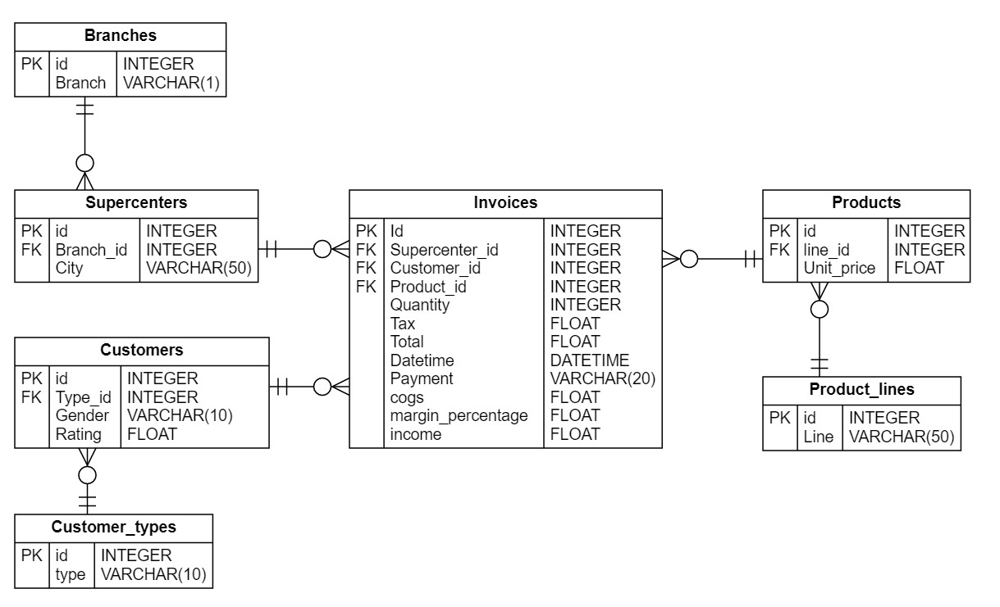
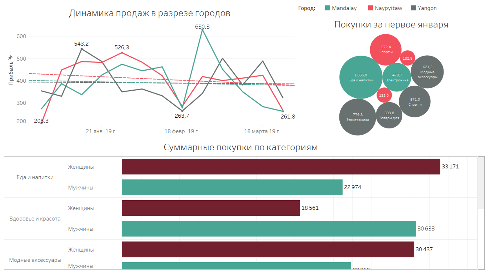

# ETL для загрузки данных с Kaggle в postgres

Репозиторий предназначен для выгрузки датасета из kaggle с использованием предоставляемого API и загрузки данных в Postgres с помощью Apache Airflow.
В данном конкретном случае выгружается датасет по продажам товаров. А схема результирующей базы данных выглядит следующим образом:



## Для запуска необходимо:
1. Получить токен для API Kaggle
2. Создать папку в корневой директории проекта *.kaggle*
3. В нее поместить *kaggle.json*, полученный при генерации токена
4. Заменить файл *.env.example* на *.env*, заполнив все поля
5. Запустить сборку докер проекта с помощью
```
docker compose up -d
```
6. На указанных в *.env* портах будут доступны Airflow с возможностью управлять дагом и Postgres с перенесенными данными

Далее данные из базы можно использовать для анализа. В качестве примера, дашборды в Tableau (workbook тоже в репозитории):

